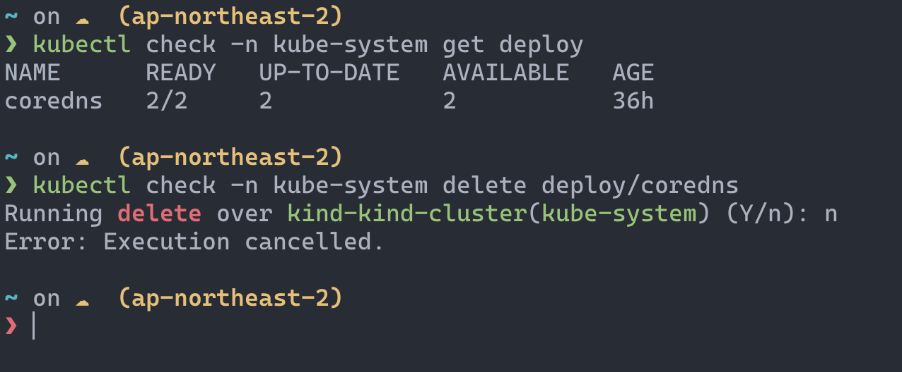

# kubectl-check



A CLI tool to prompt users for confirmation before running potentially unsafe kubectl commands.

> [!NOTE]
> The prompt is disabled when the command is excuted in non-interactive terminal.

## Installation

- **Download the binary from releases**

  Head over to the [releases page](https://github.com/beleap/kubectl-check/releases) to download the binary.
- **Using homebrew**

  ```bash
  brew install beleap/tap/kubectl-check
  ```

## Tips

- **Set alias**

  ```bash
  alias k="kubectl check"
  ```
- **Configure unsafe commands**

  Can be configured with `KUBECTL_CHECK_UNSAFE` environment variable. Provide a comma-delimited string like `edit,scale`.
  - Default unsafe commands can be found [here](https://github.com/BeLeap/kubectl-check/blob/main/src/main.rs#L63-L66).
